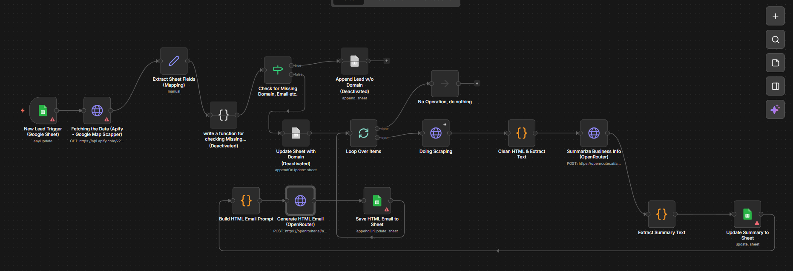

# 🚀 AI-Powered Lead Generation & Outreach Automation Workflow

An automated **lead generation and outreach system** built using **n8n, Apify, Google Sheets, and LLMs**.

This workflow automatically:
- Collects company leads
- Extracts website information
- Generates AI-powered business summaries
- Creates personalized HTML outreach emails

The goal of this project is to demonstrate how **AI + workflow automation** can streamline the entire **lead generation and sales outreach pipeline**.

---

## 📌 Project Overview

Manual lead generation and outreach can be time-consuming and repetitive.  
This project solves that problem by creating a **fully automated AI-powered workflow**.

The system performs the following tasks automatically:

✅ Collect company leads  
✅ Extract or infer company domains  
✅ Scrape website content  
✅ Generate concise business summaries using AI  
✅ Create personalized HTML outreach emails  
✅ Store results in Google Sheets  

This automation helps **sales teams, startups, and marketers scale their outreach efficiently**.

---

## 🛠️ Tech Stack

The project integrates multiple tools and APIs to build a complete automation pipeline.

- ⚙️ **n8n** – Workflow automation platform  
- 🌐 **Apify API** – Google Maps scraping for company leads  
- 📊 **Google Sheets API** – Lead database and workflow trigger  
- 🤖 **OpenRouter API** – AI model for summarization and email generation  
- 🧠 **JavaScript Functions** – Data extraction and processing  
- 📧 **HTML Email Templates** – Personalized outreach email formatting  

---

## 🔄 Workflow Architecture

The automation pipeline processes lead data step by step.

---

### 1️⃣ Lead Data Ingestion & Workflow Trigger

The workflow starts with a **Google Sheets trigger**.

Whenever a new lead is added to the sheet:

- The workflow automatically starts.
- Lead information such as **company name, email, and website** is read.

Additionally, the workflow uses the **Apify Google Maps Scraper API** to fetch business leads automatically.

These leads are then stored in **Google Sheets** for further processing.

🎯 **Purpose**

- Automate lead collection  
- Maintain a centralized lead database  

---

### 2️⃣ Extracting and Validating Domain Information

Many leads do not contain a clean website domain.

The workflow applies a validation logic:

1. If a domain already exists → use it  
2. If missing → extract domain from email  
3. If still missing → extract domain from website URL  
4. If none found → skip the lead

This ensures the workflow continues processing **even if lead data is incomplete**.

---

### 3️⃣ Website Scraping 🌐

For each valid domain:

- The workflow identifies the homepage
- Sends a scraping request
- Extracts HTML content from the website

The goal is to retrieve **text data that describes the company’s business**.

---

### 4️⃣ Cleaning Website Content 🧹

Raw website HTML contains unnecessary elements such as:

- scripts
- styles
- navigation menus
- ads

A **data cleaning function** removes these elements and extracts only **readable text content**.

This ensures the AI model receives **clean and meaningful data**.

---

### 5️⃣ AI Business Summary Generation 🤖

The cleaned website text is sent to an **LLM through OpenRouter API**.

The AI model analyzes the content and generates a **short 2–3 sentence business summary** explaining:

- what the company does
- its products or services
- its core business focus

The generated summary is stored in **Google Sheets**.

This step transforms **raw website text into structured insights**.

---

### 6️⃣ Personalized HTML Outreach Email Generation 📧

Using the business summary and lead information, the workflow constructs a prompt for the AI model.

The AI generates a **personalized HTML outreach email** that:

- references the company’s business
- sounds natural and human-written
- includes proper HTML formatting
- contains headings, paragraphs, and a CTA button

The result is a **ready-to-send outreach email template**.

---

### 7️⃣ Saving Results to Google Sheets 📊

The workflow stores all processed data in **Google Sheets**.

Saved outputs include:

- extracted domain  
- AI-generated company summary  
- personalized outreach email  
- workflow processing status  

This sheet functions as a **lightweight CRM dashboard** for managing leads.

---

## ⚠️ Error Handling

The workflow includes simple error handling.

If a lead is missing required information:

- the workflow skips the record
- logs the issue
- continues processing other leads

This prevents the entire automation from failing due to incomplete data.

---

## 📦 Project Deliverables

This repository contains:

- 📂 **Workflow JSON file** – Exported n8n automation workflow  
- 🖼️ **Workflow Screenshot** – Visual architecture of the automation pipeline 
- 📘 **README.md** – Detailed documentation of the project  

---

## ▶️ How to Use This Workflow

1️⃣ Import the JSON workflow into **n8n**  

2️⃣ Configure required API credentials:
- Apify API Key  
- Google Sheets API  
- OpenRouter API  

3️⃣ Set up the Google Sheet for lead storage  

4️⃣ Run the workflow

Once configured, the system will **automatically process leads and generate outreach emails**.

---

## 🚀 Future Improvements

Possible extensions of this project include:

- Automated email sending using SMTP
- CRM integrations (HubSpot, Salesforce)
- Multi-page website scraping
- AI-based lead scoring
- Analytics dashboard for outreach performance

---

## ⭐ Support

If you find this project useful, please consider **starring ⭐ the repository**.

---

## 🖥️ n8n Workflow Architecture

Below is the visual representation of the **complete Lead Generation Outreach Workflow**.

  

